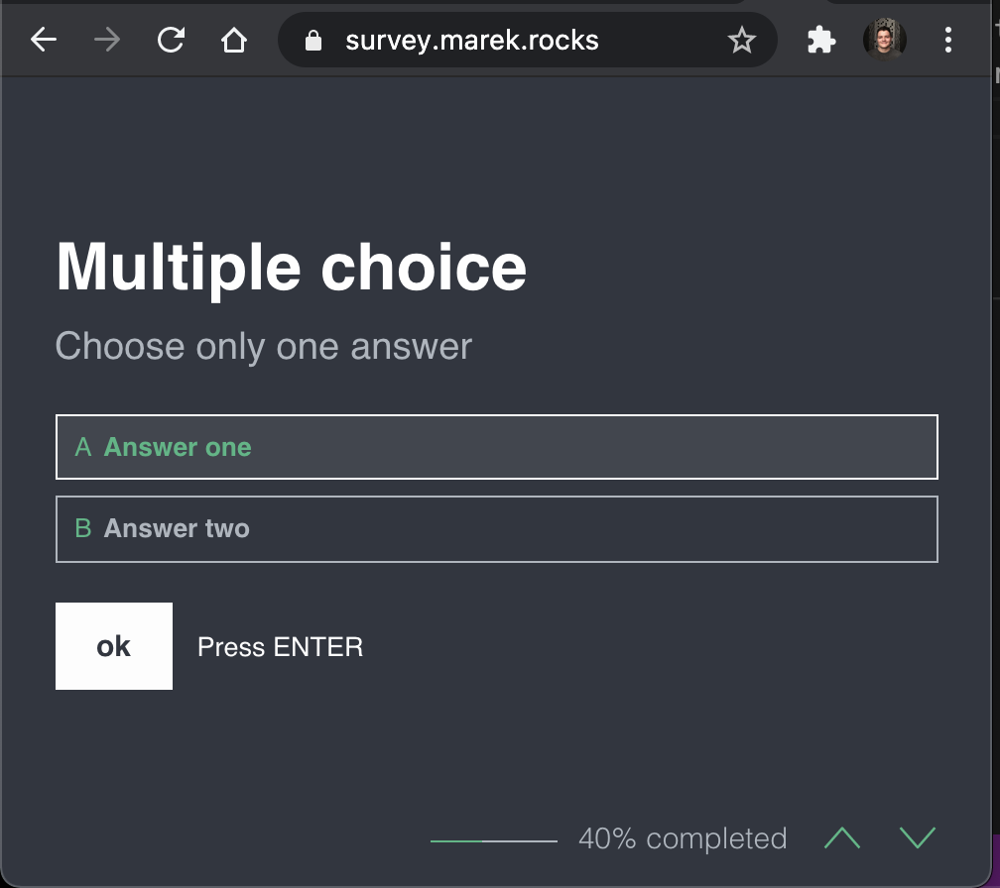

amplify-survey
--------------

Create a custom online survey webpage using AWS Amplify. This repository contains the Amplify frontend code written in Vue and the backend which consists of a GraphQL endpoint and a DynamoDB table to store survey results. You can deploy the project using Amplify by adding this repo or a fork to Amplify. 

Take a look at a live demo here; https://survey.marek.rocks/. 

Roadmap
-------

- [ ] Add the capability to easily create new surveys through admin portal.
- [ ] Add GraphQL @auth authorization to get survey results access.
- [ ] Limit sign-up access to manual approval. 
- [X] Add the capability to run surveys with different questions based on URL path.
- [X] Add user profile page. 
- [X] Add timestamp parsing to admin view. 
- [X] Add GraphQL API to submit survey results to DynamoDB. 
- [X] Add Admin portal to review survey results. 

Contact
-------

In case you have any suggestions, questions or remarks, please raise an issue or reach out to @marekq.
